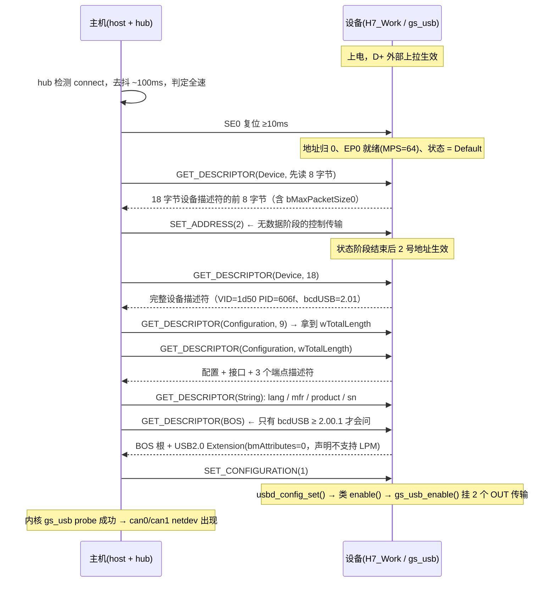

# USB2.0通信流程
> 本篇讲"协议层怎么跑"；`# USB详解` 那篇讲"本工程怎么接"。两者对照看。

## 1. 基础知识普及
| 粒度 | 英文 | 组成 | 例子 |
|---|---|---|---|
| 包 | packet | 一串位（SYNC+PID+内容+CRC+EOP） | `IN` token、`DATA1`、`ACK` |
| 事务 | transaction | token → data → handshake | 一次 IN 事务、一次 OUT 事务 |
| 传输 | transfer | 若干事务，语义完整 | 一次控制传输、一次 64B bulk 读 |
| 帧 | frame | **1 ms** 一帧，以SOF开头，里面塞满事务 | FS 每帧最多 ≈19 个 64B bulk 包 |

```md
- 介绍：SOF（Start of Frame）
1. 主机每 1 ms 发一个 SOF 包（含 11 位帧号，0~2047 循环），所有事务排进这 1 ms 的格子,组成一帧。
2. SOF 是设备唯一的"时间基准"：CONFIG_USBD_GS_USB_TIMESTAMP_SOF 就是拿它做时间戳的。
3. USB 是主机独占调度的，设备没有"想发就发"的自由。
```

```md
- 介绍：probe
1. probe 是 Linux 驱动模型里的一个回调
2. 枚举完成后，core 把设备交给gs_usb驱动
```

## 2. 电气与位级
```md
D+ / D-   一对差分线。全速：J 态 = D+ 高、K 态 = D+ 低，空闲 = J（低速相反）
NRZI 编码 数据 0 → 电平翻转；数据 1 → 电平不变
位填充    连续 6 个 1 后插一个 0（保证接收方提取时钟）
SYNC      FS 为 8 位 00000001，用于对齐位边界
EOP       ≈2 位时间 SE0 + 1 位时间 J
CRC       token 5 位、data 16 位；握手包没有 CRC
PID       4 位 PID + 4 位反码，用于校验
```

```md
接插检测与速度识别：
1) 设备在 D+ 挂 1.5 kΩ 上拉 → hub 看到 D+ 被拉高 → 判定"全速设备"（挂 D- 是低速）
2) hub 去抖约 100 ms（TATTDB）→ 上报主机
3) 主机发 SE0 复位 ≥10 ms（规范要求 reset 后 10 ms 内设备能收 SETUP）
4) 支持 HS 的设备在复位期间发 chirp K 与主机握手，成功才切到高速

- 存疑！！！！！
本工程：dts 里 maximum-speed="full-speed" + 只有内置 FS PHY → 永远 12 Mbps，不会 chirp。
      ⚠️ D+ 上拉是板上外部常闭的（不受 MCU 控制）→ MCU 复位时主机看不到掉线、不重新枚举
         → 改固件后必须拔插 USB 或跑 USB_RESET.py
```

## 3. 角色、端点、传输类型
USB 是**严格主从**：主机发起一切事务、分配一切带宽；设备只能应答，或用 NAK 说"现在不行"。
设备侧单位是**端点 EP**：

| 传输类型 | 用在 | 带宽/延迟 | 可靠性 | 本工程 |
|---|---|---|---|---|
| 控制 Control | **EP0**（必有、双向） | 保留 10% 带宽 | ACK + 重传 | 枚举 + 所有 vendor 请求 |
| 批量 Bulk | 大数据、可容忍延迟 | 无保证，见缝插针 | ACK + 重传 | IN 0x81 / OUT 0x02(+0x01) |
| 中断 Interrupt | 小数据、要延迟保证 | 保留带宽、周期轮询 | ACK + 重传 | ✗ |
| 同步 Isochronous | 音视频 | 保证带宽 | **不重传**（错就丢） | ✗ |

- FS 上限：控制/批量/中断 **8/16/32/64 B**，同步 ≤1023 B；HS 批量 512 B。
- 本工程 EP0 MPS = 64，即本工程的 EP0（控制端点）的每个事务最多传 64 字节

## 4. 事务：token + data + handshake
**token 决定方向，handshake 由接收方发。**

| 阶段 | 包类型 | 谁发 | 常见 PID |
|---|---|---|---|
| token | Token | 主机 | `OUT` `IN` `SETUP` `SOF` |
| data | Data | 双向 | `DATA0` `DATA1` |
| handshake | Handshake | 接收方 | `ACK` `NAK` `STALL`（HS 另有 `NYET`） |

```md
- OUT 事务：  [OUT token] → [DATA0/1] → [设备回 ACK / NAK / STALL]
- IN  事务：  [IN token]  → [设备回 DATA0/1 或 NAK] → [主机回 ACK]
- SETUP 事务：[SETUP] + [DATA0] → [设备 ACK]        ← SETUP 永远是 DATA0
```

```md
- 介绍：三个握手包的含义
- ACK  ：数据正确收到，本包结束
- NAK  ：暂时不能收 → 主机稍后重试。批量传输里大量 NAK 是正常的
- STALL：端点被 halt，或控制请求不支持 → 主机要用 CLEAR_FEATURE(ENDPOINT_HALT) 清（Zephyr会回调类驱动的feature_halt）
- NYET ：仅 HS OUT——本包收了，但还没准备好接下一包（流控）；FS 不需要，用 NAK 就够
```

```md
- 介绍：DATA0/DATA1 交替（data toggle）
1. 每个端点维护一个 toggle 位，每成功一发一收就翻转。作用是**识别重传**：
2. 主机没收到 ACK 会重发，设备看到 toggle 没变就知道是重复包 → 丢掉并补 ACK。
3. 控制传输的特殊规则：SETUP 恒 DATA0；数据阶段从 DATA1 开始；状态阶段恒 DATA1。
```

```md
- 介绍：传输的结束条件 = 短包
1. 包长 < wMaxPacketSize 即表示传输结束；若数据刚好是整数倍，要补一个ZLP（0 长度包）收尾。
2. 64B 批量端点发 64B 数据时必须带 ZLP。
```

## 6. 枚举流程


## 8. 数据通信
```
1. 基础单位成本:
项	                计算	        耗时	             什么时候发生
位时间  	         1/12 MHz	     83.3ns/bit     	     一直在
数据字节	           8 bit	     0.667µs/B	           有数据时
SOF 包	            35bit      	≈2.9 µs       每1ms帧1帧,每帧开头，主机必发
token包	            35 bit	    ≈2.9µs	             每个事务开头
数据包头	           35 bit	     ≈2.9µs	           事务里有数据阶段时
握手包  	           19 bit	     ≈1.6 µs	             每事务结尾
包间间隔/总线转向	     ≈6bit	    ≈0.5 µs	                每个事务
位填充	         每连续6个1插1个0	  83.3ns/bit      平均+1~3%，最坏+16.7%
- 握手包:ACK/NAK/STALL
- token包:IN/OUT/SETUP

2. 事务级成本（不考虑包间间隔和位填充）:
事务形态	             组成	                最小耗时	                                什么时候发生
NAK 事务	           54 bit                ≈4.5 µs                 主机来收但设备没帧（IN 空轮询）；OUT时RX FIFO满
SETUP 事务	         153 bit	            ≈12.75 µs	                    每次控制传输的第①阶段（8 B 数据）
ZLP 事务	            89 bit               ≈7.4 µs                每次控制传输的STATUS阶段；长度为64（MPS）整数倍的传输收尾
单包数据事务	      89+8·Data bit     	 7.4+0.667Data µs	                       所有 bulk/控制数据
多包传输        	     N个事务	         7.4N+0.667Data µs	                     FD 帧 76 B = 2 个事务
每帧批量传输额度	      1216 B    	          0.9~1 ms	             每1ms一帧，帧内先排周期性/控制，剩下的事务塞批量传输额度
- 批量传输：帧内优先级最低的传输类型，它主要用于大量、非实时、但要求可靠的数据传输，本工程95%用的都是批量传输


3. 传输级成本：
- 批量传输：
    事务类型          事务个数           组成            最小耗时
  经典CAN帧20B       1 个事务          249 bit         ≈ 20.7 µs
  CAN FD帧76B       2 个事务          786 bit         ≈ 65.5 µs
    满包64B          1 个事务          601 bit         ≈ 50.1 µs

- 控制传输（Control = SETUP + [DATA] + STATUS，STATUS 恒为 89 位的 ZLP 事务）
  类型（本工程用例）                       位数/耗时          什么时候会用到（触发场景）
  ────────────────────────────────────────────────────────────────────────────────
  无数据：SET_ADDRESS                     242 bit/20.2µs    枚举第②步：主机读完设备描述符前 8 B 后，给设备分配地址（本工程=2）
  无数据：SET_CONFIGURATION               242 bit/20.2µs    枚举最后一步；成功后 usbd 才调类 enable()，bulk 端点才可用
  无数据：MODE(RESET)/(START)             242 bit/20.2µs    ip link set canN down / up（驱动 ndo_stop/ndo_open）→ can_stop()/can_start()
                                                          （拔插 USB、卸载模块、设备复位也会发 RESET）
  无数据：SET_INTERFACE / CLEAR_FEATURE   242 bit/20.2µs    
  4 B  OUT：HOST_FORMAT                  363 bit/30.2µs    内核 gs_usb probe 的第一个请求（声明主机字节序 0xBEEF），失败直接 probe 失败
  20 B OUT：BITTIMING / DATA_BITTIMING   491 bit/40.9µs    ip link set canN type can bitrate 500000 [dbitrate 2000000]
  12 B IN ：DEVICE_CONFIG                427 bit/35.6µs    probe 的第二个请求（问 nchannels-1 与版本；决定主机建几个 canN）
  12 B IN ：GET_STATE                    427 bit/35.6µs    主机查询状态/错误计数：ip -d link show canN、ip -s link show canN
  18 B IN ：设备描述符                     475 bit/39.6µs    枚举第一批（先读 8 B 拿 bMaxPacketSize0，再读全长）
  39 B IN ：配置描述符                     643 bit/53.6µs    枚举（先读 9 B 头拿 wTotalLength，再按总长读全）
  40 B IN ：BT_CONST                     651 bit/54.2µs    驱动准备位时序时（配 bitrate / open 之前），用 fclk+上下限算 brp/tseg
  66 B IN ：序列号字符串                   948 bit/79.0µs    枚举时读 iSerialNumber；lsusb -v、udev 规则也会读（区分多台同型号）
  72 B IN ：BT_CONST_EXT                 996 bit/83.0µs    只有用到 FD 数据段波特率时（dbitrate），提供数据段上/下限

- 参考：整个枚举（标准请求全走一遍）≈ 4.8 kbit ≈ 0.4 ms 的总线时间

① 枚举（标准请求，每台设备一次）
   GET_DESCRIPTOR(Device,8) 
   → SET_ADDRESS
   → GET_DESCRIPTOR(Device,18)
   → GET_DESCRIPTOR(Config,9)
   → GET_DESCRIPTOR(Config,39)
   → GET_DESCRIPTOR(String: lang/mfr/product/sn)
   → GET_DESCRIPTOR(BOS)
   → SET_CONFIGURATION(1)                      ← 到这里类 enable()，bulk 才通

② 类驱动 probe（厂商请求，每台设备一次）
   HOST_FORMAT(0x00) 
   → DEVICE_CONFIG(0x05)     ← 决定 can0/can1 建几个
   →（每个通道）BT_CONST(0x04) 
   → BT_CONST_EXT(0x0B) 【若用 FD】

③ 通道上线（每通道、可重复）
   ip link set canN type can bitrate ...  → BITTIMING(0x01) / DATA_BITTIMING(0x0A)
   ip link set canN up                    → MODE(0x02 START) → can_set_mode()+can_start()
   ip link set canN down                  → MODE(0x02 RESET) → can_stop()
   ip -d/-s link show canN                → GET_STATE(0x0E)

④ 收尾/异常
   拔插 USB / rmmod gs_usb / 设备复位       → MODE(RESET)（驱动 disable/ndo_stop 路径）
   主机发现端点 STALL                       → CLEAR_FEATURE(ENDPOINT_HALT)

```

```
主机要收数据：发 IN token
  ├─ 设备没数据        → 回 NAK（主机下一帧再试）
  └─ 设备有数据        → 回 DATA0/1 → 主机回 ACK → toggle 翻转
主机要发数据：发 OUT token + DATA0/1
  ├─ 设备 FIFO 满/未就绪 → 回 NAK（主机重试）
  ├─ 设备收下           → 回 ACK → toggle 翻转
  └─ 端点 halt          → 回 STALL
```

本工程在这条链上又加了自己的约束：
- **IN 方向严格串行**：`in_sem` 保证同时只有1个 IN 在途 → IN 帧率≈1/往返，不只是带宽问题。
- **OUT 方向双缓冲**：收到就 `k_fifo_put(tx_fifo)` 并立刻重挂，理论上不因处理慢丢主机帧。

## 9. 异常与状态事件
| 事件 | 触发条件 | 设备要做什么 | Zephyr 落地 |
|---|---|---|---|
| Reset | 主机发 SE0 ≥10 ms | 地址归 0、EP0 复位、清配置 | `HAL_PCD_ResetCallback` → `UDC_EVT_RESET` |
| Suspend | 总线空闲 >3 ms（FS） | 进低功耗：≤500 µA(低功耗设备) / ≤2.5 mA(高功耗设备) | `HAL_PCD_SuspendCallback` → `UDC_EVT_SUSPEND` |
| Resume | 主机驱动总线 / 设备远程唤醒 | 恢复；远程唤醒需配置 bmAttributes bit5 + `SET_FEATURE(REMOTE_WAKEUP)` | `HAL_PCD_ResumeCallback` → `UDC_EVT_RESUME` |
| VBUS 插拔 | 5V 供电变化 | 切换供电/上报 | `HAL_PCD_Connect/DisconnectCallback` → `UDC_EVT_VBUS_*` |
| SOF | 每 1 ms | 可作时间基准 | `HAL_PCD_SOFCallback` → `udc_submit_sof_event()` |
| LPM(L1) | 主机发 LPM token | 声明支持才响应 | 本工程 `bmAttributes=0` → 主机不会尝试 |

## 10. 概念 → 本工程落地
| USB 概念 | 本工程落地 |
|---|---|
| PHY | OTG_HS 内置 FS PHY，PA11(D-)/PA12(D+)，48 MHz 来自 PLL1Q |
| 中断 | OTG_HS IRQ 77 → `HAL_PCD_IRQHandler()`（`udc_stm32.c` 里 `IRQ_CONNECT`） |
| 中断下半部 | `usb@40040000` 线程(coop 8) → `udc_submit_event()` |
| 协议栈 | `usbd` 线程(coop 8) → `usbd_event_handler()` |
| 标准请求 | `usbd_ch9.c: handle_setup_request()` → `std_request_to_*` |
| 厂商请求 | `nonstd_request()` → `gs_usb_control_to_dev/host()` |
| 控制传输三阶段 | EP0 + `udc_buf_info` 的 `setup/data/status` 标志（`usbd_handle_ctrl_xfer()`） |
| 端点收发 | `usbd_ep_enqueue()` → `udc_stm32` 写 OTG TX/RX FIFO |
| 配置生效 | `usbd_config_set()` → 类 `enable()` → `gs_usb_enable()` |
| 批量 IN | `gs_usb_rx_thread` → IN 端点 → `in_sem` 等完成 |
| 批量 OUT | `gs_usb_request()` → `tx_fifo` → `gs_usb_tx_thread` → `can_send()` |
| 描述符 | `inc/USB.h` 的 `USBD_*_DEFINE`；端点描述符在 `gs_usb.c: GS_USB_DEFINE_DESCRIPTOR()` |

## 11. 全速参数速查
| 参数 | 值 |
|---|---|
| 速率 | 12 Mb/s ±0.25%，位时间 83.33 ns |
| 帧 / SOF | 1 ms，帧号 11 位（0~2047 循环） |
| 复位 | SE0 ≥10 ms；之后 10 ms 内要能收 SETUP |
| EP0 MPS | 8/16/32/64（本工程 64） |
| bulk/interrupt MPS | 8/16/32/64（HS 512） |
| iso MPS | ≤1023 |
| 每帧 bulk 上限 | ≈19×64 B = 1216 B ≈ 1.2 MB/s |
| 供电 | 配置里 bMaxPower（250×2 mA = 500 mA） |
| 挂起判定 | 总线空闲 >3 ms |
| 枚举完成标志 | SET_CONFIGURATION 之后端点才可用 |

## 12. 排查：症状 → 哪一层
| 症状 | 先看哪一层 | 命令 |
|---|---|---|
| 设备完全不出现 | 电气/D+ 上拉、PD 口 | `lsusb -t`、`dmesg \| tail` |
| 出现但 `probe error -22` | 描述符/DEVICE_CONFIG 的 nchannels | `dmesg`、`lsusb -v -d 1d50:606f` |
| 有 can0 但 candump 无帧 | 类 vendor 请求 MODE(START)、回环设置 | `ip -d link show can0` |
| 有 NAK 风暴 / 数据不通 | 端点未使能、池耗尽 | `lsusb -v`（端点列表）、RTT 日志 |